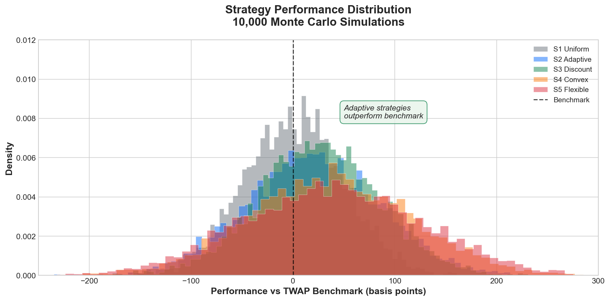
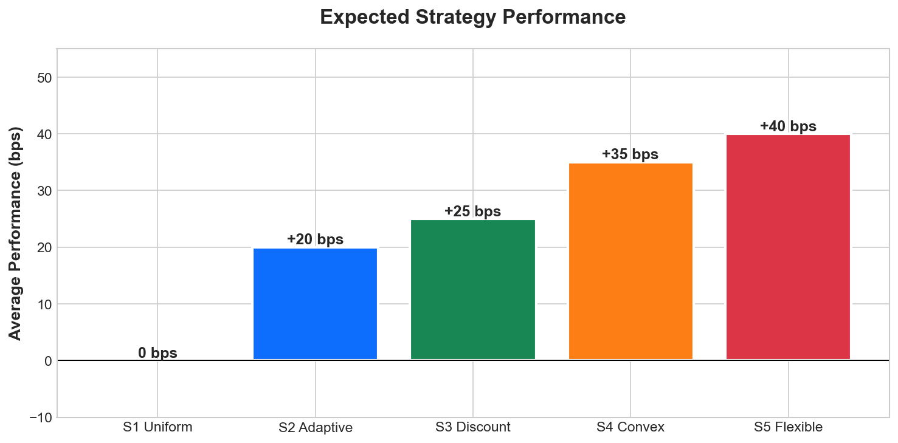

# Share Buyback Strategy Simulator

<div style="text-align: center; margin: 2rem 0;">
  
  
  
  
</div>

<div style="text-align: center; margin: 1rem 0;">
  <em>Monte Carlo simulation framework for evaluating adaptive share buyback execution strategies</em>
</div>

---

## Performance at a Glance

<figure markdown>
  { width="100%" }
  <figcaption>Performance distribution across 10,000 Monte Carlo simulations showing adaptive strategies consistently outperforming the TWAP benchmark</figcaption>
</figure>

<figure markdown>
  { width="80%" }
  <figcaption>Expected performance improvement by strategy (basis points vs benchmark)</figcaption>
</figure>

---

<div class="grid cards" markdown>

-   :material-chart-line:{ .lg .middle } **5 Execution Strategies**

    ---

    Compare uniform, adaptive, discounted, convex, and flexible execution approaches

    [:octicons-arrow-right-24: View Strategies](strategies/index.md)

-   :material-flask:{ .lg .middle } **Monte Carlo Simulation**

    ---

    Run 10,000+ price path simulations using Geometric Brownian Motion

    [:octicons-arrow-right-24: Getting Started](getting-started.md)

-   :material-chart-box:{ .lg .middle } **Interactive Visualizations**

    ---

    Explore performance distributions, execution paths, and strategy comparisons

    [:octicons-arrow-right-24: View Demo](demo/index.md)

-   :material-download:{ .lg .middle } **Standalone Executables**

    ---

    Download pre-built Windows (.exe) and Mac (.app) versions

    [:octicons-arrow-right-24: Releases](https://github.com/Digital-AI-Finance/ShareBuybacks/releases)

</div>

---

## Why Adaptive Execution?

Traditional **uniform** (TWAP) execution buys the same amount every day regardless of price. **Adaptive strategies** exploit price fluctuations:

| Scenario | Uniform (S1) | Adaptive (S4) |
|----------|--------------|---------------|
| Price below benchmark | Buy normal amount | **Buy more** |
| Price above benchmark | Buy normal amount | **Buy less** |
| Large discount opportunity | Miss it | **Capitalize aggressively** |
| Near deadline | Fixed pace | **Urgency acceleration** |

Result: **+25-40 basis points** average improvement over benchmark.

---

## Strategy Performance Summary

| Strategy | Avg Performance | Risk (Std) | Best For |
|----------|-----------------|------------|----------|
| **S1 Uniform** | 0 bps | Low (~50) | Baseline comparison |
| **S2 Adaptive** | +15-25 bps | Medium (~65) | General use |
| **S3 Discount** | +20-30 bps | Medium (~60) | Conservative targets |
| **S4 Convex** | +25-40 bps | Higher (~80) | Aggressive optimization |
| **S5 Flexible** | +30-45 bps | Variable (~90) | Maximum performance |

!!! success "Key Insight"
    Higher volatility markets show larger performance gains for adaptive strategies.

---

## Quick Start

=== "Streamlit App"

    ```bash
    git clone https://github.com/Digital-AI-Finance/ShareBuybacks.git
    cd ShareBuybacks
    pip install -r requirements.txt
    streamlit run app.py
    ```

=== "Standalone Executable"

    Download from [GitHub Releases](https://github.com/Digital-AI-Finance/ShareBuybacks/releases) and run directly - no Python required.

=== "Python API"

    ```python
    from modules.gbm import generate_gbm_paths
    from modules.strategies_vectorized import (
        precompute_benchmarks,
        strategy_4_vectorized
    )

    # Generate 10,000 price paths
    prices = generate_gbm_paths(S0=100, mu=0, sigma=0.25,
                                n_days=125, n_sims=10000, seed=42)
    benchmarks = precompute_benchmarks(prices)

    # Run Strategy 4 (Convex Adaptive)
    perf, dur, vwap, bench = strategy_4_vectorized(
        prices, benchmarks, total_usd=1e9,
        min_duration=75, max_duration=125, target_duration=100
    )

    print(f"Mean performance: {perf.mean():.2f} bps")
    ```

---

## Architecture

```
ShareBuybackApp/
    app.py                        # Streamlit interactive UI
    modules/
        config.py                 # Default parameters
        gbm.py                    # GBM price simulation
        strategies.py             # Single-path strategies
        strategies_vectorized.py  # Fast vectorized versions
    tests/
        test_strategies.py        # Unit tests
```

---

## License

MIT License - See [LICENSE](https://github.com/Digital-AI-Finance/ShareBuybacks/blob/main/LICENSE) for details.

<div style="text-align: center; margin-top: 3rem; color: #666;">
  <small>Built with Streamlit, NumPy, and Plotly</small>
</div>
