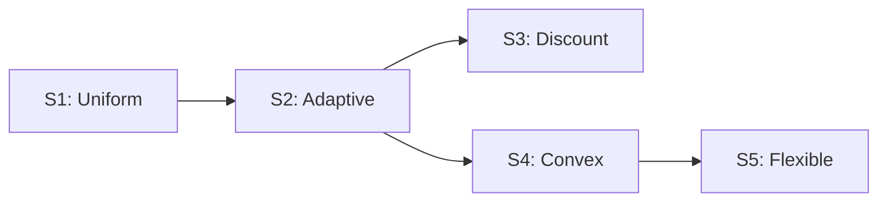

# Strategy Overview

The simulator implements five share buyback execution strategies, ranging from simple uniform execution to sophisticated adaptive algorithms.

## Strategy Comparison

| Strategy | Approach | Adaptivity | Completion | Best For |
|----------|----------|------------|------------|----------|
| **S1 Uniform** | Fixed daily amounts | None | 100% | Baseline |
| **S2 Adaptive** | Price-responsive | Linear | 100% | General use |
| **S3 Discount** | Discounted benchmark | Linear | 100% | Conservative |
| **S4 Convex** | Exponential scaling | Convex | 100% | Aggressive |
| **S5 Flexible** | Convex + partial | Convex | Variable | Maximum value |

## Key Concepts

### Benchmark (TWAP)

All strategies use **Time-Weighted Average Price (TWAP)** as the benchmark:

$$
\text{TWAP} = \frac{1}{T} \sum_{t=1}^{T} P_t
$$

This rolling benchmark updates daily and represents the "fair" average price.

### Performance Measurement

Performance is the difference between what you paid (VWAP) and the benchmark (TWAP):

$$
\text{Performance (bps)} = \frac{\text{TWAP} - \text{VWAP}}{\text{TWAP}} \times 10000
$$

### Execution Window

- **Min Duration**: Earliest the execution can complete
- **Max Duration**: Deadline - must complete by this day
- **Target Duration**: Sweet spot between min and max

## Strategy Evolution

Each strategy builds on previous ones:

1. **S1** establishes the baseline (uniform execution)
2. **S2** adds price adaptivity (buy more when cheap)
3. **S3** modifies the benchmark with a discount
4. **S4** uses convex (exponential) scaling for bigger bets on discounts
5. **S5** allows partial completion to avoid forced buying at bad prices

## Choosing a Strategy

!!! tip "For most use cases"
    **Strategy 4 (Convex)** offers the best risk-adjusted returns for typical market conditions.

!!! note "For conservative mandates"
    **Strategy 3 (Discount)** with a small discount provides consistent outperformance with lower variance.

!!! warning "For maximum performance (with risk)"
    **Strategy 5 (Flexible)** with 90-95% min completion can significantly outperform but may not fully execute.
